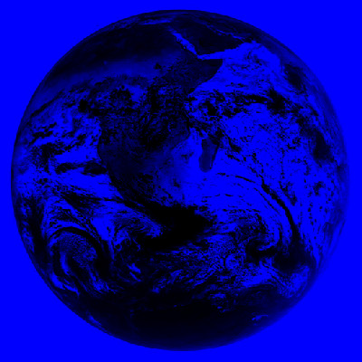

# pixmap-ops

Image manipulation demos based on the PPM image format.

## How to build

*Windows*

Open git bash to the directory containing this repository.

```
pixmap-ops $ mkdir build
pixmap-ops $ cd build
pixmap-ops/build $ cmake -G "Visual Studio 16 2019" ..
pixmap-ops/build $ start Pixmap-Ops.sln
```

Your solution file should contain two projects: `pixmap_art` and `pixmap_test`.
To run from the git bash command shell, 

```
pixmap-ops/build $ ../bin/Debug/pixmap_test
pixmap-ops/build $ ../bin/Debug/pixmap_art
```

*macOS*

Open terminal to the directory containing this repository.

```
pixmap-ops $ mkdir build
pixmap-ops $ cd build
pixmap-ops/build $ cmake ..
pixmap-ops/build $ make
```

To run each program from build, you would type

```
pixmap-ops/build $ ../bin/pixmap_test
pixmap-ops/build $ ../bin/pixmap_art
```

## Image operators

Along with the required methods, ppm_image.cpp implements a border() method, 
which creates a purple border along the inside of an image, a swirl method,
which rearanges the rgb values such that r=b, g=r, and b=g in the returned
image, an invert() method, which subtracts each rgb value from 255, a random()
method, which randomizes the color of each pixel, an extract_red() method,
which sets g and b values of each pixel to 0, conserving only r values, and a 
box_blur() method, which makes each pixel an average of itself and the 8 pixels 
surrounding it. 

The ppm_image.cpp file contains tests for each one of these methods individually,
using the soup.ppm file. 

## Results

For this image, I inverted the colors, extracted red, swirled the colors, then 
applied a border around the inside edge. 


For this image, I inverted the colors, extracted red, swirled the colors twice,
then applied gamma correction.




For this image, I randomaized the colors, applied a box blur, added a border, and 
blurred it twice more, in order to create a static television-like artwork.

